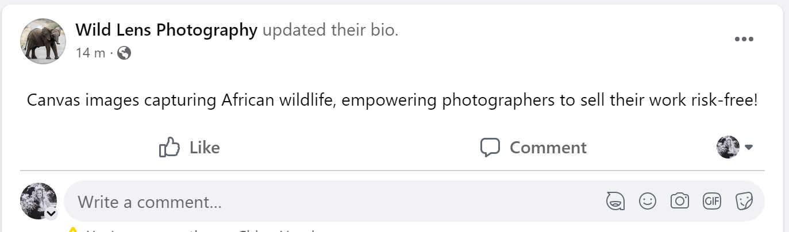

# Wild Lense Photography

## Overview
#### Business Model Underlying my app
  
The heart of my wildlife photography app revolves around a dynamic e-commerce business model that fuels the ecosystem for both buyers and photographers. At its core, the app serves as a vibrant marketplace where enthusiasts can immerse themselves in the captivating world of African wildlife prints while offering photographers a platform to showcase and sell their artistry.

For buyers, the app provides an array of exquisite wildlife prints that capture the essence of Africa's diverse fauna. The e-commerce model seamlessly integrates secure payment gateways, ensuring smooth transactions. Buyers can easily explore various categories such as Animals, Birds, Landscapes, and the iconic Big 5, gaining access to a curated selection of high-quality prints. The system offers a user-friendly interface where customers can navigate, filter, and purchase prints effortlessly.

On the flip side, the app caters to aspiring and established wildlife photographers, empowering them to turn their passion into profit. Photographers can create personalized profiles, upload their captivating shots, and set prices for their prints. The business model ensures a secure platform where photographers can manage their inventory, monitor sales, and gain valuable insights into customer preferences.

Revenue is generated through a commission-based system, wherein the app takes a percentage of each successful sale. This ensures a win-win scenario for both photographers, who gain an income stream from their art, and buyers, who can acquire unique wildlife prints. The app's business model is designed to foster a thriving community of nature enthusiasts and photographers, enabling them to connect, engage, and contribute to the preservation of wildlife while indulging in the beauty of these extraordinary prints.
#### Site Purpose:

The website serves a dual purpose: firstly, as a haven for those seeking to purchase captivating canvas images showing the essence of African Wildlife. This offers an ideal avenue for those seeking unique gift concepts or for those who have embarked on memorable safari journeys, yearning to immortalize their experiences with evocative imagery reminiscent of their trips and encounters.

  

The website's secondary objective revolves around empowering budding photographers. This particularly caters to those immersed in Africa's wildlife realm and photographers who lack the avenue, resources, or a substantial social presence to independently market their captivating images. Wildlense extends a risk-free digital platform, liberating these emerging photographers from the financial burden of establishing their own website or business infrastructure. Moreover, it offers an avenue to cultivate a dedicated audience for their work, propelling them into the public eye. This strategic exposure holds the potential to transform their passion into a viable revenue stream.

As a site owner the idea is to make money through the promotion and sale of these young photographers' work. As a percentage of every sale they make will be paid to me as the site owner. This is achieved by running a site with extremely good UX and UI so that potential buyers are encouraged to purchase the photographs and also find the entire process seamless and intuitive.

  

In order to encourage repeat customers and brand loyalty the site will also have a newsletter featuring tips and tricks from experts in the field, news on conservation initiatives across different parks and wildlife areas as well as reviews of different cameras and equipment and special offers on photographs.This will require a user registration to the site.

#### Value to Users 
This wildlife photography platform brings immense value to users by providing a captivating and immersive experience that celebrates the beauty of nature and wildlife. For photography enthusiasts and art lovers, the platform serves as a hub of inspiration, offering a diverse collection of high-quality prints capturing the splendor of African wildlife. Users can explore a wide array of categories, from majestic animals to breathtaking landscapes, all expertly curated to evoke a sense of wonder and appreciation for the natural world.

For photographers, the platform opens doors to a global audience, enabling them to showcase their unique perspectives and artistic talents. Budding and seasoned wildlife photographers alike can gain recognition, connect with a passionate community, and earn income by selling their prints. The platform fosters collaboration and growth, allowing photographers to establish their portfolios and build a reputable brand.

Additionally, the site promotes wildlife conservation by connecting users with stunning imagery that underscores the importance of protecting these vulnerable ecosystems. As users engage with captivating visuals, they become more aware of the urgent need for conservation efforts.

From appreciating awe-inspiring prints to supporting photographers and contributing to wildlife preservation, this platform offers a multifaceted experience that empowers users to explore, connect, and make a positive impact. It merges art, technology, and environmental consciousness to create a space that resonates with individuals seeking inspiration, community, and a meaningful connection to the natural world.

## Features

### Existing features
- On the home page users are presented with a clean menu as well as two boxes to eithe register as a photographer or browse the photographers photos to buy. This brings the site purpose directly into play from th moment the new user lands on the page.
- Navigating to the registration page allows a new user to sign up as a photographer. However They first have to be a registered user on the site to do this. If they aren't they will be re-directed to the registration page.
- Navigating to the buy now button takes users to the products page

- Features include the abilitiy to browse a group of photographs to buy.
- The photographs can be filtered with some usefull builtin filters.
- Or photographs can be searched for with the helpfull search bar. 

- Users can then select individual photographs for a detailed view with the option to add them to their basket before browsing further or they can then go straight to the checkout page.
- Helpfull messages are presented when users add or edit products to their bag.
- Users are able to select a size and quantity on the product page before adding it to their bag.

-Users can then navigate to the checkout page and either delete the product or go to secure checkout. 
Here they are presented with a summary of their bag and also a total cost. 

-In the checkout section users fill in their buying details and are able to checkout securely. 
-This then gives them a order summary and sets their basket back to zero. 
They can then choose to go back to the site or leave from their.

-Users can also browse photographers individual profiles allowing them to connect more with the photographers 
-They can then also filter just by that photographers images to view them.

-Photographers on the site have the ability add and edit their own images as well as their personal profile. This is a section of the page that is only available to registered photographers to provide security for them.

-Registered users can log in and view their profile details and their previous order history

-Anonymous users are able to buy products but don't have access to any other authorised activity on the site. 

-Staff users can add, edit or delete products a once logged into their staff account. However this is protected by site owner and that authorisation can only be done in the admin panel by the site owner. 

### Future features
- **CRUD**: One the basket page in future I would like to add the ability to edit quantities of their bag.
-   **Product Variety and Pricing**: Future improvements will introduce various print sizes and customizable options like build-your-own canvases. Prices will vary based on size, making the buying experience more realistic and tailored.
    
-   **Photographer Profiles**: Photographer profiles will link to their live social media and websites, enhancing authenticity and user engagement.
    
-   **User Image Uploads**: Users can upload their own images for printing through an upload form, allowing personalization.
    
-   **Interactions**: A like button for images will encourage user engagement. A zoom option for photos enhances image exploration.
    
-   **Discounts and Customization**: Coupon codes and discounts will be introduced. Users can customize canvas choices, including frame options. A preview of selected frames will be shown before purchase.
    
-   **Image Alignment**: Adjustments will be made to align images based on their orientation (portrait or landscape) for improved user experience.
    
-   **Signature Consideration**: Photographers uploading signed images will also provide unsigned versions for buyers who prefer it that way.
    
-   **Diverse Image Types**: Plans include expanding image types, featuring global wildlife or other styles.
    
-   **User-Uploaded Prints**: Users will have the option to upload their images for printing, broadening the selection.
    
-   **Pagination for Products**: The "All Products" page will load a limited number of items per page, enhancing site speed and user experience.
    

These improvements aim to create a vibrant and user-friendly platform that caters to both photographers and enthusiasts, fostering a thriving community around wildlife photography and art.
## Testing

### Manual Testing

I have conducted manual testing across every section of the website, evaluating the functionality of all buttons, links, and elements. Through comprehensive testing, I ensured the seamless performance of each interactive component, guaranteeing a user-friendly experience. This approach allowed me to identify and rectify any issues, ensuring the optimal functionality and responsiveness of the site. These issues will be spoken about below. This testing has fortified the site's reliability, enhancing user satisfaction and overall performance.

- On the home page users are presented with a clean menu as well as two boxes to eithe register as a photographer or browse the photographers photos to buy. This brings the site purpose directly into play from th moment the new user lands on the page.
- Navigating to the registration page allows a new user to sign up as a photographer. However They first have to be a registered user on the site to do this. If they aren't they will be re-directed to the registration page.
- Navigating to the buy now button takes users to the products page

- Features include the abilitiy to browse a group of photographs to buy.
- The photographs can be filtered with some usefull builtin filters.
- Or photographs can be searched for with the helpfull search bar. 
#### Tested
These features have been tested to ensure all buttons links and filters work.
Incorrect search critria have been added to try and break the searches 

- Users can then select individual photographs for a detailed view with the option to add them to their basket before browsing further or they can then go straight to the checkout page.
- Helpfull messages are presented when users add or edit products to their bag.
- Users are able to select a size and quantity on the product page before adding it to their bag.
#### Tested 
Buttons have been checked that they all work properly and go to the desired page or do the desired task.
Incorrect inputs have been added to quantity selection. 
Tried adding 0 or over the limit of selectors to make sure they work 
Tried adding words to number selectors.

-Users can then navigate to the checkout page and either delete the product or go to secure checkout. 
Here they are presented with a summary of their bag and also a total cost. 
#### Tested 
Tested delete functionality and made sure it works as expected.
Go to basket page directs to correct page and sends correct basket information

-In the checkout section users fill in their buying details and are able to checkout securely. 
-This then gives them a order summary and sets their basket back to zero. 
They can then choose to go back to the site or leave from their.
#### Tested 
Tested incorrect details and and inputacross all of the form. Validation works and returns helpfull error messages
tried leaving out information or leaving required fields blank all for validation caught and dealt with these errors 

-Users can also browse photographers individual profiles allowing them to connect more with the photographers 
-They can then also filter just by that photographers images to view them.
#### Tested 
Tested filtering and profile view. Found bugs with rendering correct photographer and their images. Used correct notation to filter properly. All recorder in git commits.

-Photographers on the site have the ability add and edit their own images as well as their personal profile. This is a section of the page that is only available to registered photographers to provide security for them.
#### Tested 
Tested that only logged in photographer can acces their profile for edit. Created groups in admin and assigned photographer to groups to allow this. Again had to fix my if statements so that only logged in user could edit their page . instead of filtering just used hard coding to make sure user only had their profile displayed.

-Registered users can log in and view their profile details and their previous order history
#### Tested 
Tested registration and login functionality and made sure all validation worked and displayed correctly. 
login and registration with incorrect details was tested and errors caught and handled
tried to create same user multiple times but sight wouldn't allow it. 
tried to full in incorrect details or leave required fields blank but form validation provides an error and displays to user allowing them to fix it. 

-Anonymous users are able to buy products but don't have access to any other authorised activity on the site. 

-Staff users can add, edit or delete products a once logged into their staff account. However this is protected by site owner and that authorisation can only be done in the admin panel by the site owner. 
#### Tested 
Tested validation and trying to access the page without being admin fail safes in place to prevent it from happening even if users edited the url in their browser still provides an error and will require login before users have access to the edit and delete products button

#### Stripe Protection
In cases where our view experiences a delay in creating the order before the webhook is received from Stripe, there's a potential risk that the webhook handler won't initially locate the order in the database. Consequently, this can lead to duplicate order creation, as the webhook handler might generate the order itself once the view finally completes.

To address this, we can introduce a brief delay. This approach involves implementing a five-second delay, allowing the webhook handler multiple attempts to find the order in the database.

An additional consideration is the scenario where a customer makes duplicate purchases on separate occasions. This situation could lead to identifying the first order in the database when placing the second order, resulting in the second order not being added. To tackle this issue, we propose the addition of two new fields to the order model:

1.  A text field to store the original shopping bag that initiated the order.
2.  A character field to store the unique Stripe payment intent ID.

By implementing these measures, we ensure a smoother order processing experience and avoid potential conflicts arising from delayed order creation and duplicate purchases.
 #### More Manual Testing 
 All clickable options were tested to ensure they lead to the correct page.

The image quality has been tested to ensure users can clearly view and appreciate the intricacy of the photography.

Each page was opened and displayed as …

The site's responsiveness was trialed on different devices and over multiple screen sizes such as mobile to large screen, this was specifically to ensure photos were still in order and the site worked seamlessly following the UX and UI.

I tested for error scenarios and invalid inputs in the different forms and quantity selectors, for example; typing in a word rather than a number, this ensured that incorrect values cannot be put into the site. This was also tested in the registration area of the site particularly with an email address to ensure that correct emails are given by the user.

Tests were carried out to ensure a user could not login with incorrect details, password validation was also tested.

Information has been stored securely for all registered users, data basis have been backed up with no access from others or unregistered users.

Users who are not an admin cannot get access or alter the site without having to go through the code, therefore all the necessary protocols have been put in to ensure that there is full site protection and authentication. Admin can only be added through an admin panel by an already existing admin.

Photographers (sellers) profiles are protected through authentication to ensure the general public don’t have access to their images or profiles other than to view as a user prior to purchase. There is no way a site visitor could edit or delete a photographer's profile or details.

Banking details are all held securely so no fraudulent actions can be taken.

The entire process of adding a photograph to be printed on canvas and proceeding to the checkout has been tested, including varied sizes and purchasing multiple images. Friends and family have tried and tested the site to ensure everything functions as it should. Feedback from them was also appreciated in the making of the site.

  
  

All links filters and searches were tested and made sure all the images were in the correct categories and all filters applied correctly.

All buy now buttons were checked across the whole site to ensure they all added products to the basket

### Site Responsiveness
I used responsive design checker to check the responsiveness of my site across different devices and found it to be responsive across all pages and over a range of small to large screen size.
https://responsivedesignchecker.com/checker.php?url=https%3A%2F%2F8000-dyl06-wildlens-0oyg6fykr23.ws-eu104.gitpod.io%2F&width=1400&height=700
### Code Validation 
My code was run through code validator and came back clean. Bellow are all the validators I used f the code. 
CSS Validators

[https://jigsaw.w3.org/css-validator/validator](https://jigsaw.w3.org/css-validator/validator)

[https://jigsaw.w3.org/css-validator/validator](https://jigsaw.w3.org/css-validator/validator)

[https://jigsaw.w3.org/css-validator/validator](https://jigsaw.w3.org/css-validator/validator)
https://jigsaw.w3.org/css-validator/validator?uri=https%3A%2F%2Fresponsivedesignchecker.com%2Fchecker.php%3Furl%3Dhttps%253A%252F%252F8000-dyl06-wildlens-0oyg6fykr23.ws-eu104.gitpod.io%252F%26width%3D1400%26height%3D700&profile=css3svg&usermedium=all&warning=1&vextwarning=&lang=en
I also Used flake8 linter to check all the code and files on the IDE and all issues where fixed.
### User Stories/ Features

### Bugs
##### Bugs I Encountered
- When I first applied the big 5 category filter it didnt actually filter like it was supposed to. Instead it just sent back a full list of all products. Had to adjust my filtering method in the code base.
- When using the search bar it is displaying duplicates of the same image. Again once my filtering was adjusted this sorted the problem
- Add to bag button weren't working. I hadn't loaded the javascript script tags correctly once that was loaded all worked as expected.
- Basket was displaying £10 when it was empty as the if statement wasn't working and saw the delivery charge as a charge to display. fixed that through corrrect python syntax.
- Add to basket button had the basket outside the actual button because it was an input so changed it to a button with a submit on it and put the font awesome basket icon inside the button.
- Basket summary wasn't rendering properly this was due to incorrect syntax when rendering the items to the page. experimented with print statement to determine the correct syntax and fixed the summary display. Some element where also outside of the for loop and so didn't display as expected or return values I was expecting in the summary
- Footer was originally fixed and prevented buttons at the bottm of the screen from being clicked esspecially on small screens. Adjusted the bootstrap styling to fix this.
- Originally had two menus which meant that on small and medium screens I had two hamburger menus displaying which looked very strange and wasn't with convention or good UI. Consolidated both menus into one to make the site easier to use but also more intuitive.
- Spinner and loading overlay that sets a delay when buying a product wasn't working at first this was because javascript hadn't been loaded into the right place on my site. 

### UX & UI
UX

  

The Wild Lense site has been tested over multiple devices and operating systems and screen sizes such as; Windows, MAC, iPhone, Chrome, Safari, ipad Linux etc. to ensure it has a user-friendly and responsive design for devices users may have.

  

The site has been designed for user experience to be optimized with efficiency and quality for the user at the core. The options given for the user to click all have the same styling, this helps the site flow throughout each page and allows the navigation to be very intuitive. It is clear to understand the purpose of the site, buyers can find a ‘buy product’ page quickly and distinctly.

  

I have implemented a filter system that allows users to search and browse images by specific wildlife categories, such as Big 5, birds etc. This makes it easy and quicker for users to find images that align with their interests. There is also the option for the user to search by photographer, so if they have a specific photographer they are interested in, they can access their images quickly and filter their photos more specifically.

  

Each photograph on the site has a captivating description to provide more of an insight to the wildlife depicted and the perspective of the photographer. This also encourages the user to connect emotionally with the image.

  

All forms for the adding of images profiles or editing of themare really simple and intuitive for users wether first time or returning users. Layout is clean and easy without any distractions, inputs follow a logical order and are easy to understand without needing any explanations. For validation provides users with error reports if they have filled anything in incorrectly or missed anything out. All these forms have been thoroughly tested to ensure they won’t accept any incorrect inputs. Info messages are displayed when editing of products/profiles occurs and helpful success messages display upon submitting of the form.

  
  

The website has an explicit login and registration function that allows users to register and save their details so that future purchases can be made easier and more swiftly, this design creates a good business platform for the site and encourages users to come back and reuse the site.

When purchasing an item, users have the option to check out as a guest whilst also giving an option to create an account for easier future purchases.

The images shown are attractively presented and are of high quality, this has been prioritized to showcase the details of each photo and to allow users to feel a connection with the photo.

This creates a better user experience. payment system,

  

Product images are displayed with optimal sizing to ensure they look as appealing as possible to users. While this means that some of the box sizes on large screens will be different and it looks slightly strange the benefit of having better quality images is worth it and makes for a better user experience and better business sense as sight users are more likely to buy appealing images and they will be more confident to pay for a better looking and cropped image. Also most people shop on mobile and tablet devices now which is where the product view really stands out. As images are aligned one on top of the other.

  

With the vast number of products available there have been numerous filters put in place to ensure users can find images they have an interest in more quickly. This also provides a better user experience all round.

### SEO

Through strategic implementation of SEO techniques, this wildlife photography platform enhances its online visibility and user engagement. Meta descriptions are thoughtfully crafted, offering succinct yet captivating summaries that entice users to explore further. Carefully chosen keywords, seamlessly integrated into meta tags and image attributes, amplify search engine rankings, ensuring the site is discoverable by users seeking wildlife-related content. Photographs are meticulously named and alt attributes are optimized with relevant keywords, enhancing accessibility for visually impaired users while bolstering SEO performance. This comprehensive approach combines aesthetic appeal with strategic optimization, resulting in improved search engine visibility, higher organic traffic, and an enriched user experience for nature enthusiasts and photographers alike.

#### SEO Keywords

  

All images have been given descriptive tags and their alt tags are all the images names. These have been designed with seo keyword structures in place and they have been designed and thought out for maximum google search findability.

  

I have used animals specific names rather than just bird or antelope to help with better google search results and ranking and to give my site better ranking with google. Wildlife enthusiasts are likely to search for animals and birds by their specific names meaning that this site is likely to feature more highly in google search results.

Images are all named with keyword names and attr tags all have the image name as an internal link to them. This will help with SEO implementation and allows google to rank my site more highly.

  

#### Future SEO

  

In future I would like to link to charities and safari operators and companies to be endorsed by them and support wildlife and conservation charities. Having links to their websites will improve the search engine ranking of my site and allow for better user traffic to the site which in turns should drive sales.

### Marketing 
The implementation of strategic marketing elements on my website underscores a holistic approach to reaching and engaging with a broader audience. In addition to crafting a visually captivating platform, I've taken crucial steps to ensure seamless discoverability and user interaction.

Firstly, the inclusion of a sitemap.xml and a robots.txt file ensures that search engines effectively crawl and index my site, leading to improved visibility in search results. This diligent technical foundation empowers the site's organic growth.

Furthermore, the incorporation of a user-friendly newsletter signup form allows me to gather interested users' contact information for tailored communication, fostering a stronger connection. Leveraging this engagement, I've established Facebook and Instagram pages, aligned with the brand's ethos, to cultivate a vibrant community and share captivating wildlife visuals.

Employing marketing best practices, the website promotes user interaction through social sharing, enticing visitors to spread the word organically. Additionally, by adhering to SEO guidelines, meta descriptions and keywords have been carefully curated, enhancing the site's search engine rankings and drawing in enthusiasts seeking wildlife-focused content.
## Facebook 
[]
[]
[]
[]
[media/readme/social_media/Post example 3.PNG]
[media/readme/social_media/Post example 4.PNG]
media/readme/social_media/Post example.PNG
[]
[]
[media/readme/social_media/Instagram Wild Lens profile.PNG]
[]

## Wireframes
[]
[]
[]
[]
[]
[]
[]
[]
[]
[]
[]
[]
[]

## Website Screenshots

## Deployment 
The site has been built in github with gitpod this is the link https://8000-dyl06-wildlens-0oyg6fykr23.ws-eu104.gitpod.io/

The site was then deployed to heroku and has used cloudinary to store the image and elephantsql for the database. The payment and checkout has been handle with stripe and their is an email signup hosted by mailchimp.
Here is the deployed sites link: https://wildlensphotography-70bfdf68090b.herokuapp.com/

## Credits

#### Media 
All media came from the mentioned photographers: Charles Henderson
																						Bradley Henderson
																						Nic Andrew
They are all real photographers who have kindly let me use their images for the making of this site. 

#### Useful Websites
Home page header, used the documentation from bootstrap to create a responsive header.

[https://getbootstrap.com/docs/5.3/components/navbar/](https://getbootstrap.com/docs/5.3/components/navbar/)

  

Also used the boutique ado if statements for the authentication and basket totals in my head element.

  

Deciding how to add image fields in my products model

[https://www.appsloveworld.com/django/100/284/django-best-practice-for-storing-images-urlfield-vs-imagefield?utm_content=cmp-true](https://www.appsloveworld.com/django/100/284/django-best-practice-for-storing-images-urlfield-vs-imagefield?utm_content=cmp-true)

  

Context processors to pull photographers for the site nav heading

[https://stackoverflow.com/questions/2893724/creating-my-own-context-processor-in-django](https://stackoverflow.com/questions/2893724/creating-my-own-context-processor-in-django)

  

[https://docs.djangoproject.com/en/4.2/topics/auth/default/#creating-users](https://docs.djangoproject.com/en/4.2/topics/auth/default/#creating-users)

[https://docs.djangoproject.com/en/4.2/topics/auth/customizing/#extending-the-existing-user-model](https://docs.djangoproject.com/en/4.2/topics/auth/customizing/#extending-the-existing-user-model)

  

How to implement and structure different user roles and authentication.

[https://simpleisbetterthancomplex.com/tutorial/2018/01/18/how-to-implement-multiple-user-types-with-django.html](https://simpleisbetterthancomplex.com/tutorial/2018/01/18/how-to-implement-multiple-user-types-with-django.html)

  

How to register and login users

[https://ordinarycoders.com/blog/article/django-user-register-login-logout](https://ordinarycoders.com/blog/article/django-user-register-login-logout)

  

Had to reset some of migrations as i deleted an app that other apps depended on, which caused issues with the site.

[https://simpleisbetterthancomplex.com/tutorial/2016/07/26/how-to-reset-migrations.html](https://simpleisbetterthancomplex.com/tutorial/2016/07/26/how-to-reset-migrations.html)

  

SEO naming of files.

[https://developers.google.com/style/filenames#:~:text=Use%20hyphens%2C%20not%20underscores%2C%20to,presence%20can%20negatively%20affect%20SEO](https://developers.google.com/style/filenames#:~:text=Use%20hyphens%2C%20not%20underscores%2C%20to,presence%20can%20negatively%20affect%20SEO).

  

Template for photographer profile edit page

[https://www.bootdey.com/snippets/view/bs4-edit-profile-page#html](https://www.bootdey.com/snippets/view/bs4-edit-profile-page#html)

  
  

Used this as a guide for my shopping bag template

[https://mdbootstrap.com/docs/standard/extended/shopping-carts/](https://mdbootstrap.com/docs/standard/extended/shopping-carts/)

  
  

Widgets from django to make image editor better

[https://github.com/django/django/blob/main/django/forms/templates/django/forms/widgets/clearable_file_input.html](https://github.com/django/django/blob/main/django/forms/templates/django/forms/widgets/clearable_file_input.html)

  
  

Adding users to groups and authenticating them in the groups for restricted access and permissions

https://docs.djangoproject.com/en/4.2/topics/auth/default/#groups

[https://code.djangoproject.com/ticket/31266](https://code.djangoproject.com/ticket/31266)

  

Crispy Forms

[https://django-crispy-forms.readthedocs.io/en/latest/](https://django-crispy-forms.readthedocs.io/en/latest/)

